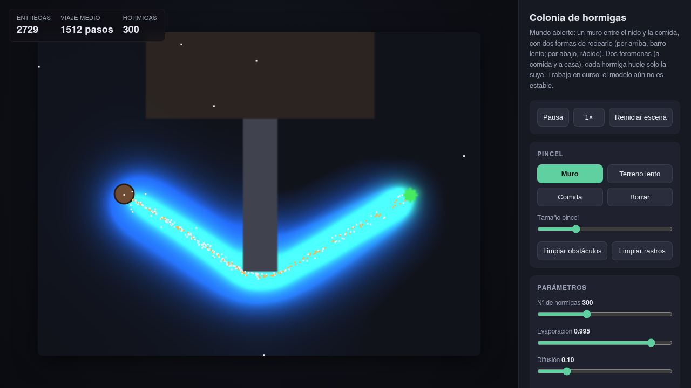

# Ant colony · emergent order

A simulation of ants that, each following **very simple local rules with no
knowledge of the map**, find the food by getting around a wall and slow terrain,
and **optimize the fastest route** to it. Nobody decides the route:
it **emerges** from the collective reinforcement of pheromones.

It's an agent-to-agent system in a continuous world, from the family of classic
foraging sims (Sebastian Lague style): two pheromones, decaying deposit, evaporation.



## How to run

Open `index.html` in your browser. No server or dependencies needed.

```
xdg-open index.html
```

## The scene

- **Nest** on the left, **food** on the right.
- A **wall** in the middle: it must be skirted above or below.
- The **top** detour is **slow terrain (mud)**; the **bottom** one is **fast**. They're
  almost the same length, but the colony converges on the bottom one: it optimizes for **speed**.

You can paint walls, mud and food with the mouse and watch it re-optimize live.

## The model (local rules, nothing global)

Two pheromones and "dumb" ants that only smell and walk:

- **Two trails**: `toFood` (laid by ants returning with food) and `toHome` (laid by
  ants leaving the nest). Each ant **smells only the one for its goal** and ignores the
  other: explorers follow `toFood` toward the food, carriers follow `toHome` toward home.
  It heads where it **smells the most**, using 3 wide-radius antennae.

- **Decaying deposit (Lague style)**: each ant starts with a full "charge" when leaving
  the nest or picking up food, and **deposits less on every step** as it runs out.
  That creates the **gradient** (the trail is stronger near its origin), which is what
  makes "follow the strongest" meaningful. The deposit is scaled by speed,
  so mud doesn't over-accumulate just because it takes more steps.

- **The wall blocks smell**: an antenna whose path crosses a wall detects nothing, so
  the wide radius helps cut corners in the open but never through the wall.

- **Local sense of the goal**: if a carrier **sees the nest** up close (or an explorer
  **sees the food**), it goes straight for it, overriding the pheromones. This prevents
  ants from circling endlessly right next to home or the food.

- **Explorer repulsion from the home trail**: explorers steer slightly away from
  `toHome`, which pushes them to explore outward (and makes the trail bootstrap reliably).

- **Evaporation + diffusion**: `toFood` evaporates fast (the slow route fades and only
  the heavily repainted one, the fast one, survives) and `toHome` slowly (it persists, so
  carriers always have a way back). Ants are released **gradually**
  (not in a wave), for a continuous flow and a stable trail.

Why the fast route emerges: it gets traveled more times per minute, receives more
pheromone before evaporating and gets reinforced; the slow one is repainted less and
dies out. Snowball effect.

## Validation

`headless-test.js` runs the **same `core.js`** without a browser and measures, over
time, the pheromone on the slow detour (top) versus the fast one (bottom):

```
node headless-test.js
```

Typical result: the colony consistently converges on the **fast route (~99%)**,
with a strong, stable trail and sustained deliveries.

## Files

- `core.js` — the whole simulation (no DOM). Used as-is in the browser and in the test.
- `sim.js` — canvas rendering (food trail in green, home trail in blue) and UI.
- `index.html` / `style.css` — page and styles.
- `headless-test.js` — command-line validation.

## Note

As in real colonies, there's some randomness (symmetry breaking). The terrain asymmetry
reliably tips the balance toward the fast route, but the system is
stochastic, not 100% deterministic.
